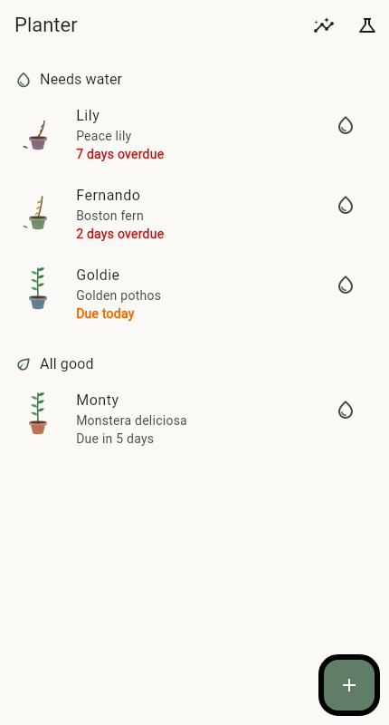
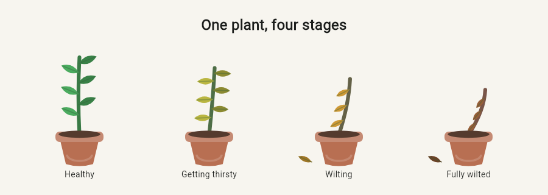

# Planter

Planter is an offline Flutter houseplant-care tracker. It turns each watering
schedule into animated artwork: a healthy plant stands tall and green, then
leans, yellows, browns, and sheds leaves as it becomes overdue.



## What it does

- Adds, edits, waters, and deletes plants with local persistence.
- Groups plants into **Needs water** and **All good**, sorted by urgency.
- Animates a custom-painted plant from healthy to fully wilted without image
  assets or fixed state changes.
- Tracks notes and one of five pot colors per plant.
- Calculates on-time watering reliability, current streaks, overdue totals,
  monthly waterings, the thirstiest plant, and an eight-week activity heatmap.
- Supports system light/dark mode and descriptive artwork semantics.

## The wilt animation

The same painter is shown below at four health values. Stem height and lean,
leaf angle, leaf size, color, and shedding all respond to the single continuous
`health` input.



Health is derived from `lastWatered`, `waterEveryDays`, and the current date.
It stays at `1.0` through the due date and declines across one additional
watering interval until it reaches `0.0`. Watering therefore updates facts,
not presentation state.

## Run it

Prerequisites: a Flutter SDK compatible with Dart 3.13.1 or newer.

```sh
flutter pub get
flutter run
```

On a debug build, use the flask button in the app bar to open the painter lab.
Its slider exercises every health value from `1.0` to `0.0`.

Run the quality gates with:

```sh
flutter analyze
flutter test
```

## Project guide

- [`lib/models`](lib/models) contains persisted plant data and pure derived
  calculations.
- [`lib/state`](lib/state) owns mutations and persistence write-through.
- [`lib/screens`](lib/screens) contains the home, form, detail, stats, and debug
  experiences.
- [`lib/widgets/plant_artwork.dart`](lib/widgets/plant_artwork.dart) contains
  the animated widget and `CustomPainter`.
- [`docs/architecture.md`](docs/architecture.md) explains the design and
  tradeoffs.
- [`docs/demo-script.md`](docs/demo-script.md) is a short live-demo walkthrough.

All data stays on the device as one JSON value in `shared_preferences`; the app
has no account, network, or native-service dependency.
